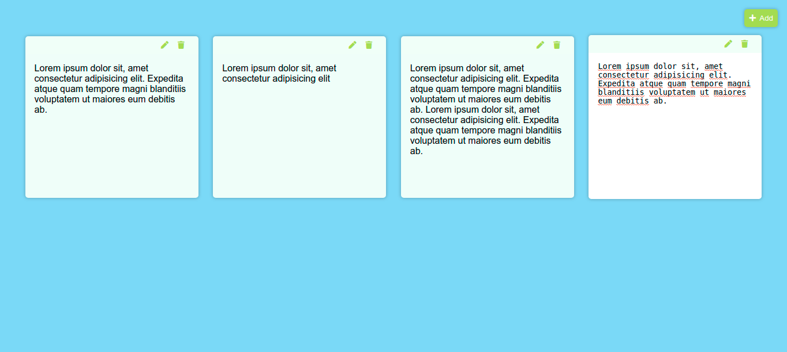

#### A notes app with CRUD operation using javascript

Libraries used -
- Marked.js : For converting text to markdown
 
Features : 
- You can add note.
- Edit the note.
- Update the note.
- Delete the note.
- Save the notes.
- convert the text to markdown

Screenshot : 

